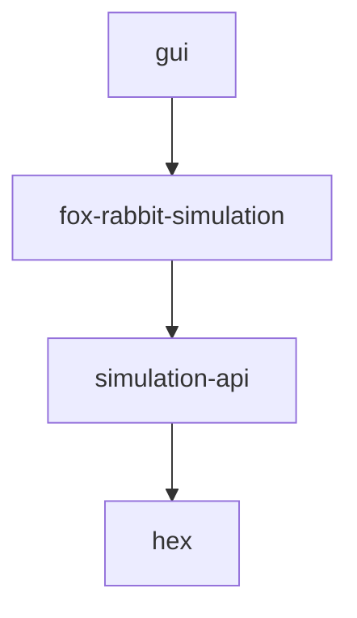

# Prerequisites
* Java 17
* JAVA_HOME environment variable is set up to point to the path of the JAVA 17 jre.

# Start application
In the main folder of the application (HexSim) use
## Linux
~~~
./gradlew run
~~~

## Windows
~~~
gradlew run
~~~

# Configuration
## Config file location 
~~~
fox-rabbit-simulation/src/main/java/hu/crs/hex/simulation/foxrabbitsimulation/FoxRabbitSimulationConfig.java
~~~

# Modules
* hex: Generic tooling for representing hexboards
* simulation-api: API of the Simulations
* fox-rabbit-simulation: A concrete simulation simulating interactions of foxes, rabbits and grass
* gui: A generic gui for representing a simulation

## Dependencies

# Resources
https://www.redblobgames.com/grids/hexagons/